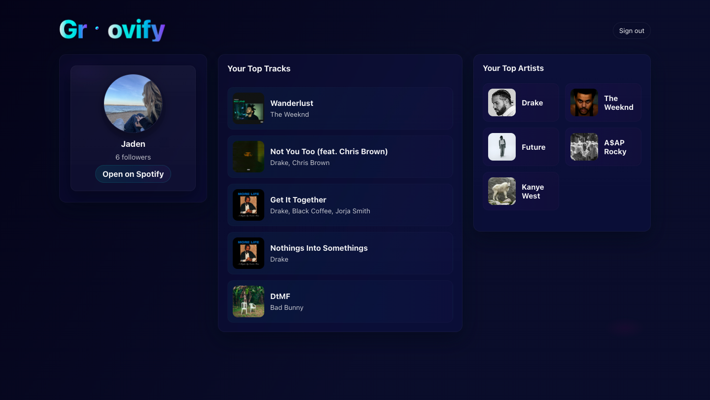

# Groovify

Groovify is a web application that transforms a user’s Spotify listening data into an interactive and visually engaging experience. By securely connecting to a Spotify account, the application presents personalized insights into listening activity through a modern, responsive interface.

The project focuses on combining clean user experience design with real-time data from the Spotify Web API to create a polished, production-ready application.

---

## Preview



---

## Features

- Secure Spotify OAuth authentication  
- Personalized listening insights  
- Modern, responsive user interface  
- Optimized performance across desktop and mobile devices  

---

## Technology Stack

**Frontend**
- React (Vite)
- Custom CSS for animations and layout

**Backend**
- Node.js
- Express

**API**
- Spotify Web API

**Hosting**
- Render Cloud

---

## Getting Started

### Clone the repository
```bash
git clone https://github.com/itshisoka17/groovify.git
cd groovify
```

### Install Dependencies
```bash
npm install
```

### Run Frontend Only
```bash
npm run dev
```

### Run Application
```bash
node .
```

## License
Apache License 2.0

Copyright © 2025 Jxdn